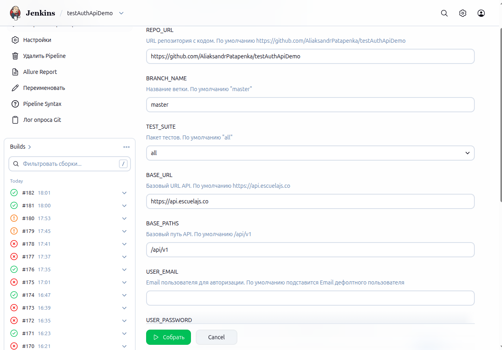
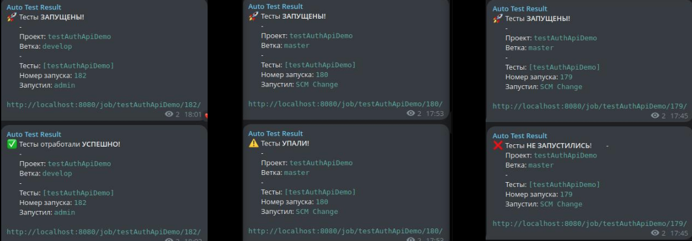
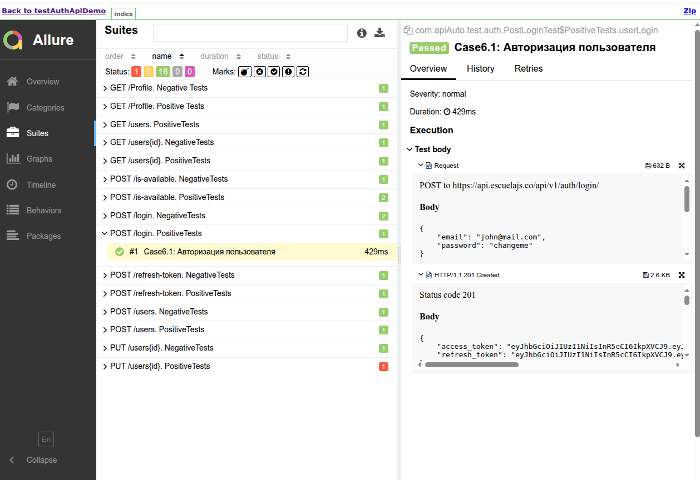
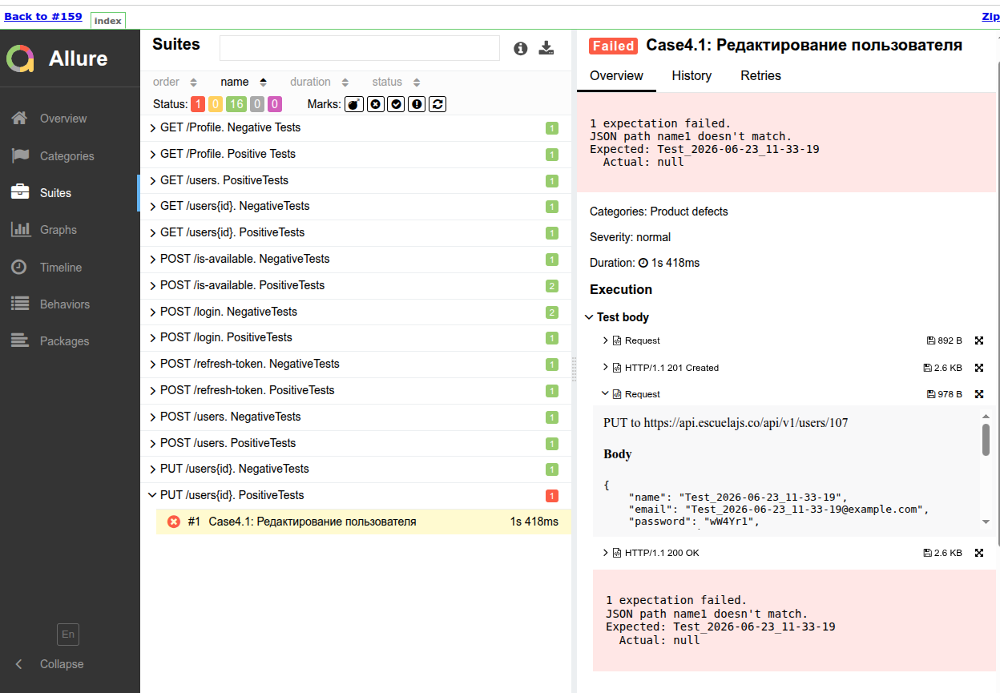

# Фреймворк для API тестирования (RestAssured + JUnit 5) с Telegram-уведомлениями

Автоматизированные тесты для REST API с использованием **RestAssured**, **JUnit 5**, **Allure Reports** и интеграцией с **Jenkins**. Реализована поддержка параллельного выполнения тестов, генерации тестовых данных, валидации JSON Schema и отправки уведомлений в Telegram о результатах сборки.

В качестве демонстрации возможностей фреймворк покрывает тестами публичное API [Platzi Fake Store API](https://fakeapi.platzi.com/en/about/introduction/).

---

## Используемые технологии

| Технология | Версия |
|:-----------|:-------|
| **Java** | 17 | 
| **RestAssured** | 5.3.0 |
| **JUnit 5** | 5.10.0 |
| **Jackson** | 2.15.2 |
| **JSON Schema Validator** | 5.3.0 |
| **Allure Framework** | 2.25.0 |
| **Maven** | 3.x |
| **Jenkins** | - |

---

## Структура проекта

```
src/test/java/com/apiAuto/
├── base/                       # Базовые настройки
│   ├── properties/
│   │   ├── config/             # Конфигурация (URL, таймауты, тестовые данные)
│   │   └── patch/              # Endpoints (AuthPatch, UsersPatch и т.д.)
│   └── Specs.java              # Request/Response спецификации RestAssured
│
├── helpers/                    # Вспомогательные классы
│   ├── authHelper/             # Помощники для авторизации
│   ├── testHelper/             # Генерация данных, сериализация JSON
│   └── userHelper/             # Шаблоны для создания/обновления пользователей
│
├── models/                     # POJO-модели для запросов
│   ├── auth/                   # Модели для авторизации (Login, RefreshToken)
│   └── users/                  # Модели для пользователей (Create, Update, CheckEmail)
│
└── test/                       # Тест-классы
    ├── auth/                   # Тесты для блока auth (Login, Profile, RefreshToken)
    └── users/                  # Тесты для блока users (CRUD, IsAvailable)

src/test/resources/
├── schemas/                    # JSON Schema для валидации ответов
│   ├── errorSchema/            # Схемы для ошибок (400, 401, 404)
│   ├── userCrudSchema/         # Схемы для CRUD пользователей
│   └── userAuthSchema/         # Схемы для авторизации
├── allure.properties           # Настройки Allure
├── junit-platform.properties   # Параллельный запуск JUnit
└── local.properties            # Локальные настройки (игнорируется в Jenkins)
```

## Команды для запуска

**Запуск всех тестов и генерация Allure-отчета:**
```
mvn clean test; allure generate target/allure-results --clean -o allure-report; allure open allure-report

```

### Параллельный запуск тестов

В проекте настроен параллельный запуск тестов для ускорения выполнения:
- **JUnit уровень** — `junit-platform.properties`
- **Maven уровень** — `maven-surefire-plugin`

---

## CI/CD (Jenkins)

Проект интегрирован с Jenkins. Пайплайн (`Jenkinsfile`) поддерживает параметризированную сборку:

**Параметры сборки:**
- `REPO_URL` — ссылка на тестируемый репозиторий репозитория
- `BRANCH_NAME` — ветка тестируемого репозитория
- `TEST_SUITE` — пакет тестов
- `BASE_URL` — базовый URL API
- `BASE_PATHS` — базовый путь API
- `USER_EMAIL` — email для авторизации (подставляется из Jenkins Credentials)
- `USER_PASSWORD` — пароль для авторизации (подставляется из Jenkins Credentials)

**Страница запуска сборки в Jenkins:**



---

## Telegram-уведомления

Jenkins-пайплайн отправляет уведомления в Telegram о статусе сборки:

- 🚀 Тесты **ЗАПУШЕНЫ!**
- ✅ Тесты отработали **УСПЕШНО!**
- ⚠️ Тесты **УПАЛИ!**
- ❌ Тесты **НЕ ЗАПУСТИЛИСЬ!**

**Пример уведомлений в Telegram:**



---

## Allure-отчетность

После выполнения тестов генерируется детальный Allure-отчет.

**Пример отчета (Тест пройден успешно):**

 

**Пример отчета (Тест упал):**



---

# Чеклист покрытия тестами API

## Позитивные тесты

| № метода | № кейса | Метод | Название теста | Статус код |
|----------|---------|-------|----------------|------------|
| 1 | | POST /users — Создание пользователя | | |
| | Case1.1 | POST /users | Создание пользователя | 201 |
| 2 | | GET /users — Получение списка пользователей | | |
| | Case2.1 | GET /users | Получение списка пользователей | 200 |
| 3 | | GET /users/{id} — Получение пользователя по ID | | |
| | Case3.1 | GET /users/{id} | Получение данных по пользователю | 200 |
| 4 | | PUT /users/{id} — Редактирование пользователя | | |
| | Case4.1 | PUT /users/{id} | Редактирование пользователя | 200 |
| 5 | | POST /is-available — Проверка доступности email | | |
| | Case5.1 | POST /is-available | Проверка доступности email (Пользователь существует) | 201 |
| | Case5.2 | POST /is-available | Проверка доступности email (Пользователь не существует) | 201 |
| 6 | | POST /login — Авторизация пользователя | | |
| | Case6.1 | POST /login | Авторизация пользователя | 201 |
| 7 | | POST /refresh-token — Обновление токена | | |
| | Case7.1 | POST /refresh-token | Обновление токена | 201 |
| 8 | | GET /profile — Получение профиля пользователя | | |
| | Case8.1 | GET /profile | Переход в профиль пользователя | 200 |

## Негативные тесты

| № метода | № кейса | Метод | Название теста | Статус код |
|----------|---------|-------|----------------|------------|
| 1 | | POST /users — Создание пользователя | | |
| | Case1.1 | POST /users | Создание пользователя при отсутствии в запросе ключа email | 400 |
| 3 | | GET /users/{id} — Получение пользователя по ID | | |
| | Case3.1 | GET /users/{id} | Получение данных по несуществующему пользователю | 400 |
| 4 | | PUT /users/{id} — Редактирование пользователя | | |
| | Case4.1 | PUT /users/{id} | Редактирование пользователя при введенном некорректном Email | 400 |
| 5 | | POST /is-available — Проверка доступности email | | |
| | Case5.1 | POST /is-available | Проверка доступности email при email = null | 400 |
| 6 | | POST /login — Авторизация пользователя | | |
| | Case6.1 | POST /login | Неверный логин пользователя | 401 |
| | Case6.2 | POST /login | Неверный пароль пользователя | 401 |
| 7 | | POST /refresh-token — Обновление токена | | |
| | Case7.1 | POST /refresh-token | Ошибка обновления токена (пустое тело запроса) | 400 |
| 8 | | GET /profile — Получение профиля пользователя | | |
| | Case8.1 | GET /profile | Ответ 401 при переходе в профиль пользователя | 401 |

---

## Лицензия

Этот проект является демонстрационным и не имеет лицензии. Используйте на свой страх и риск:)